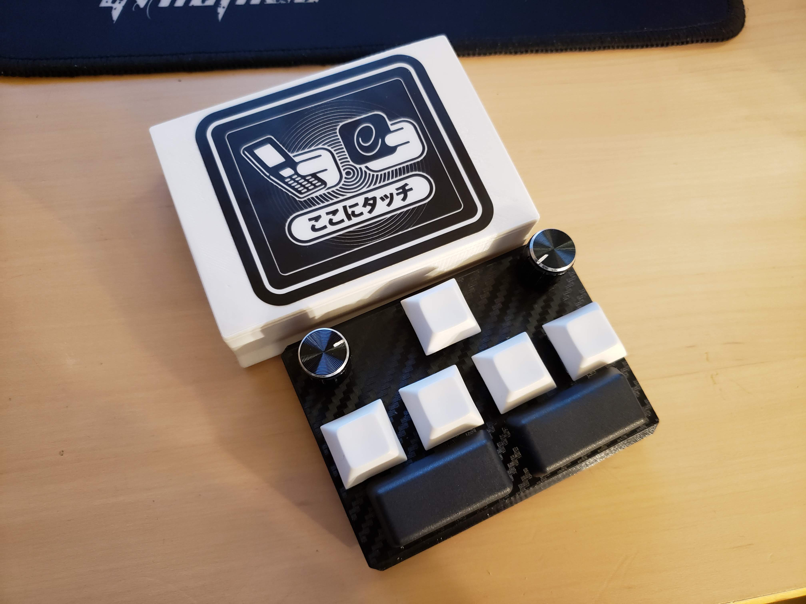
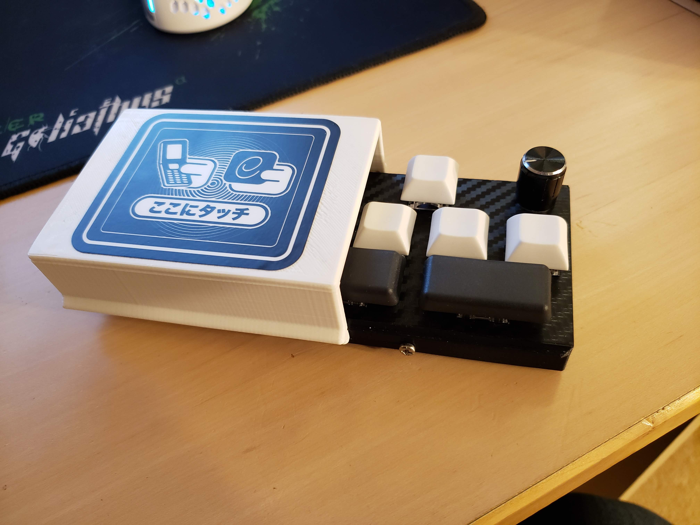

# Pico-SDVX
Honestly, don't make this controller.  Really.

But if you are a madlad and still want to make one for fun, here it is.  I'm not intending to support this controller, as if you are making this I am assuming you are fine with fiddly soldering work and have built a controller already.

## Parts Required:
- 1x Raspberry Pi Pico
- 7x cherry mx style switches of your choice
- 2x https://www.amazon.com/gp/product/B07R6BZVBT/ BUT THESE LOVE TO SKIP STEPS AND REQUIRE DISASSEMBLY TO TAKE THE DETENT OUT.  I think ALPS EC11E183440C (might be a little tall for the case, 20mm vs 15mm so clearance will be very close) or Bourns PEC11R-4015K-N0024(might be a tight fit in the body) would fit.
- 7x LEDs for reactive lighting, choose colors of your choice
- 7x 100Ohm Resistors
- 4x rubber feet, diameter ~10mm or so
- 3x M3x5 screws
- 2x Knobs (10pcs Aluminum Hi-Fi CD Volume Tone Control Potentiometer Knob 6mm Black 20) is the exact listing name.  Specs: Knob Diameter: 12.5mm, Knob Height: 16mm, Installation Hole Diameter: 6mm
- 5x 1u DSA/G20/F10 keycaps
- 2x 2u DSA/G20/F10 keycaps
- A bunch of thin wire.  As usual, I cut a bit of cat5e and used the strands inside.
- 3D print Body, Cover, and Case(optional, but it's pretty cool tbh)
- Vinyl skin for Body
- 1x Micro USB Cable

## Assembly Instructions
- Insert switches into case
- Clip LED + Leg and Resistor and solder together.
- Insert LEDs into case
- Solder - LED leg to one of the switch pins.  This pin is ground now.
- Solder daisy chain ground wire between switches.
- Solder wires to other switch leads
- Solder encoders to Pi Pico
- Solder switch wires & ground to Pi Pico
- Flash Pi Pico(hold button down when plugging in, drag and drop build/src/pico_sdvx.uf2 from repo Pico-Game-Controller and test
- Mount encoders with nut and washer
- Flatten cables and snap Pi Pico into the cover.  Pull back on the clip a little if you need do.  Micro USB port into cutout first, then clip it in.
- Close cover and screw together.  Add rubber feet.  Test to make sure everything still works.
- Slide the cover on the rail.  Done!
